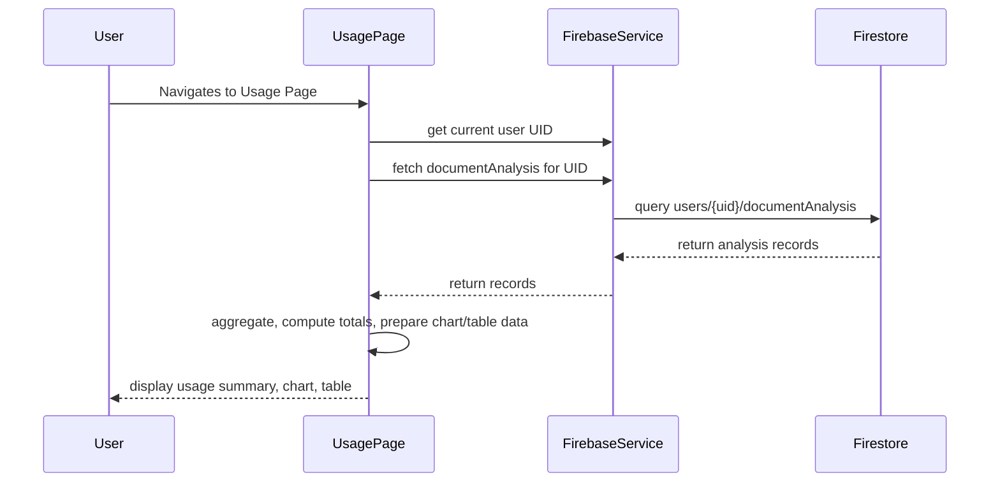

# Plan: Displaying Historical Usage for the Logged-In User

## 1. Business/User Perspective

- **Target:** Business customers using the API.
- **Metric:** Number of pages processed (from `nbPages` in `documentAnalysis`).
- **Goal:** Help users track document processing activity and anticipate billing.

## 2. Data Model & Retrieval

- **Firestore:** Each user has a `documentAnalysis` subcollection with fields: `documentName`, `nbPages`, `runAt`.
- **Retrieval:** Fetch all `documentAnalysis` records for the logged-in user, aggregate by time period, and sum `nbPages`.

## 3. UI/UX Design

- **Display:**
  - **Total Pages Processed** (lifetime and/or current billing period)
  - **Usage Over Time** (chart: pages processed per day/week/month)
  - **Recent Activity Table** (document name, date, pages)
  - **Billing/Quota Info** (e.g., "X of Y pages this month", based on plan)

## 4. Subscription Plans & Quotas

- **Plans (from `SubscriptionPage.tsx`):**
  - **Basic:** Pay as you go, $1.95 per 100 pages
  - **Pro:** 1000 pages/month, $9.95/month
  - **Business:** 10000 pages/month, $49.95/month
- **Quota Display:** Show remaining pages for the current period, and highlight when the user is approaching or exceeding their quota.

## 5. Implementation Steps

### a. Backend/Firestore

- Use Firestore functions to fetch and aggregate usage data.
- Calculate usage for the current billing period (e.g., current month) to compare against plan quota.

### b. Frontend (UsagePage.tsx)

- On mount, fetch the user's `documentAnalysis` records.
- Compute:
  - Total pages processed (lifetime and current period)
  - Pages processed per day/week/month (for chart)
  - List of recent analyses (sorted by `runAt`)
  - Pages remaining in current plan (if applicable)
- Display:
  - Summary section (totals, quota)
  - Chart (using a chart library, e.g., Chart.js or Recharts)
  - Table (recent activity)
  - Billing/quota info

### c. Authentication

- Ensure the user is logged in and their UID is available to fetch their data.

## 6. Example Data Flow

## 7. Considerations

- **Performance:** Paginate or limit records for large users.
- **Time Zones:** Display `runAt` in user's local time.
- **Billing Period:** Highlight current month usage if pricing is monthly.
- **Extensibility:** Allow for future usage metrics.

---

**This plan is ready for implementation.**